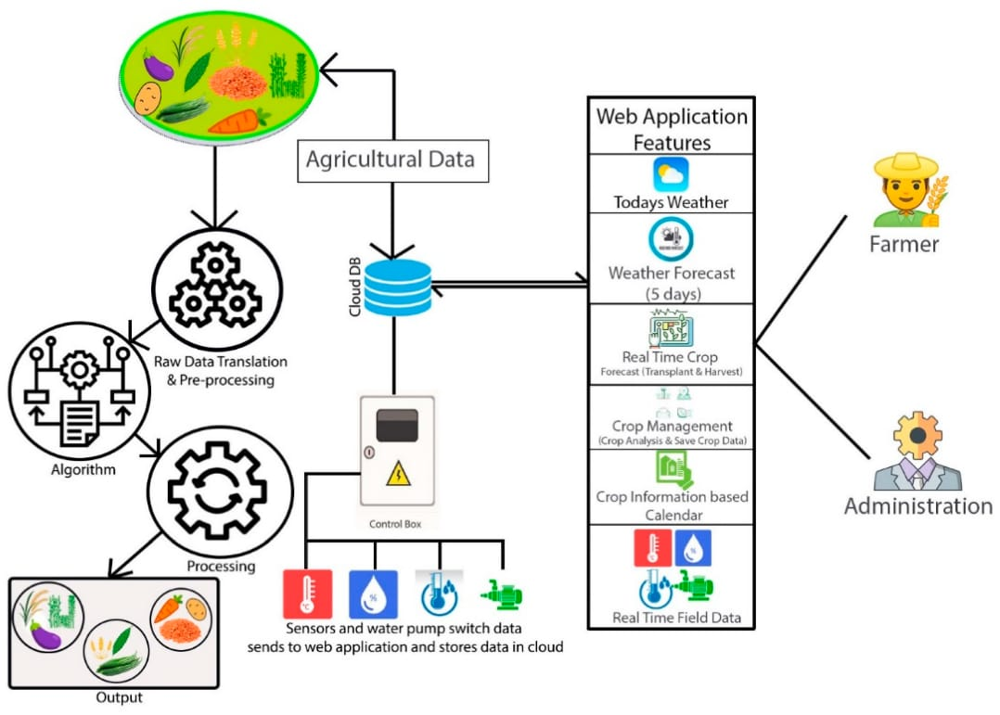
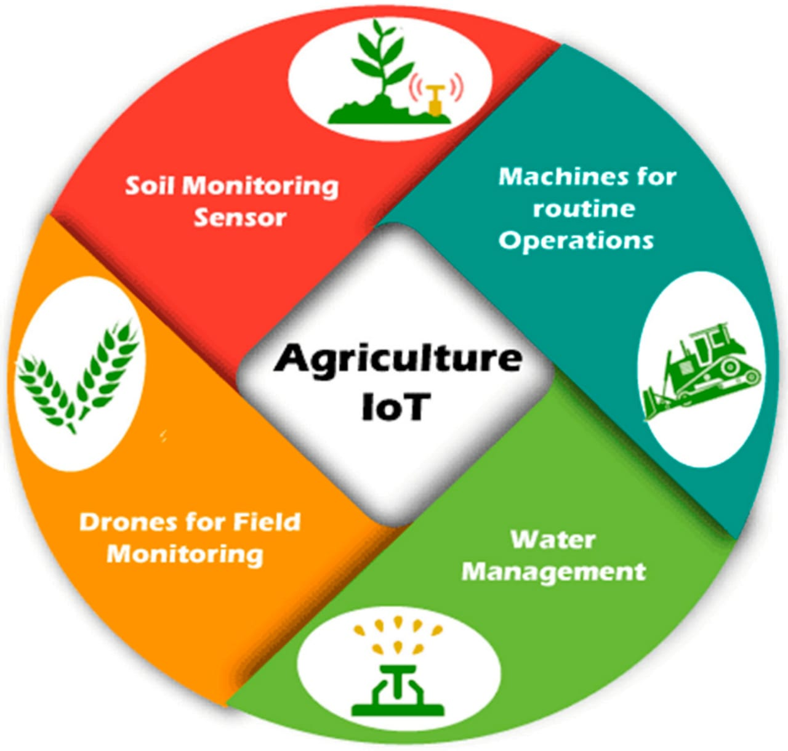

# Smart India Hackathon Workshop
# Date:1.10.2025
## Register Number:25016362
## Name:HARIHARAN M
## Problem Title
SIH 25010: Smart Crop Advisory System for Small and Marginal Farmers
## Problem Description
A majority of small and marginal farmers in India rely on traditional knowledge, local shopkeepers, or guesswork for crop selection, pest control, and fertilizer use. They lack access to personalized, real-time advisory services that account for soil type, weather conditions, and crop history. This often leads to poor yield, excessive input costs, and environmental degradation due to overuse of chemicals. Language barriers, low digital literacy, and absence of localized tools further limit their access to modern agri-tech resources.

Impact / Why this problem needs to be solved

Helping small farmers make informed decisions can significantly increase productivity, reduce costs, and improve livelihoods. It also contributes to sustainable farming practices, food security, and environmental conservation. A smart advisory solution can empower farmers with scientific insights in their native language and reduce dependency on unreliable third-party advice.

Expected Outcomes

• A multilingual, AI-based mobile app or chatbot that provides real-time, location-specific crop advisory.
• Soil health recommendations and fertilizer guidance.
• Weather-based alerts and predictive insights.
• Pest/disease detection via image uploads.
• Market price tracking.
• Voice support for low-literate users.
• Feedback and usage data collection for continuous improvement.

Relevant Stakeholders / Beneficiaries

• Small and marginal farmers
• Agricultural extension officers
• Government agriculture departments
• NGOs and cooperatives
• Agri-tech startups

Supporting Data

• 86% of Indian farmers are small or marginal (NABARD Report, 2022).
• Studies show ICT-based advisories can increase crop yield by 20–30%.

## Problem Creater's Organization
Government of Punjab

## Theme
Agriculture, FoodTech & Rural Development

## Proposed Solution
```
Small and marginal farmers often make decisions based on intuition or local advice, which can be outdated or inaccurate. Our solution is a Smart Crop Advisory System that:

- Uses AI and machine learning to analyze soil, weather, and crop data  
- Provides personalized recommendations for crop selection, fertilizer use, and pest control  
- Supports multilingual voice and text interfaces for accessibility  
- Integrates market price tracking to help farmers choose profitable crops  
- Offers image-based pest detection using computer vision  

Why it’s unique:
- Hyper-local insights tailored to individual plots  
- Offline functionality for low-connectivity regions  
- Feedback loop to improve recommendations over time  
- Designed for low-literacy users with intuitive UI and voice support  
```

## Technical Approach
```
Technologies Used:
- Backend: Python (FastAPI), Firebase for real-time database and authentication  
- Frontend: React (Web), React Native (Mobile), Tailwind CSS for responsive UI  
- AI Models:  
  - Crop recommendation: Random Forest, Decision Trees  
  - Pest detection: CNN (Convolutional Neural Networks)  
- APIs:  
  - OpenWeatherMap for weather data  
  - Agmarknet for market prices  
  - OpenAI Whisper for voice-to-text  
  - OpenAI GPT for natural language advisory  

Implementation Flow:
1. Data Collection:  
   - Farmer inputs: location, crop history, preferences  
   - Sensor data: soil moisture, pH, temperature (optional IoT)  
   - External APIs: weather, market prices

2. Processing & Analysis:  
   - ML models analyze inputs  
   - Generate crop, fertilizer, and pest control recommendations  
   - Predict yield and cost-benefit analysis

3. User Interaction:  
   - Dashboard with multilingual support  
   - Voice-based queries and responses  
   - Alerts for pest outbreaks and weather risks

4. Feedback Loop:  
   - Farmers rate advice  
   - System learns and adapts over time

```

## Feasibility and Viability
```
Technical Feasibility
The Smart Crop Advisory System is technically sound and highly implementable. It leverages open-source technologies such as Python, FastAPI, and React, along with publicly available APIs for weather, soil, and market data. This ensures low development costs and easy integration. The system is designed to run smoothly on low-cost smartphones and tablets, making it accessible to small and marginal farmers. Its modular architecture allows for phased development—starting with basic crop recommendations and scaling up to include IoT sensors, image-based pest detection, and market analytics. Offline functionality ensures usability in areas with limited internet access, and multilingual support makes it inclusive for farmers across different regions.

---

 Financial Viability
Financially, the system is designed to be sustainable and scalable. Initial deployment can be supported through government schemes like Digital India or PM-Kisan, as well as partnerships with NGOs and CSR initiatives. The business model can follow a freemium structure—offering essential advisory services for free, while premium features such as advanced analytics and agribusiness dashboards are monetized for cooperatives or commercial users. Over time, farmers benefit from reduced input costs, optimized crop selection, and improved yields, leading to significant economic gains. The system’s low operational cost and high return on investment make it a viable solution for long-term rural development.

---

 Challenges and Solutions
To ensure smooth adoption and usability, the following challenges have been identified along with practical solutions:

- Poor internet access: Implement an offline-first design with periodic data synchronization.  
- Language barriers: Integrate voice-based interaction and support for regional languages.  
- Hardware cost: Make sensor integration optional so farmers can use the system without additional devices.  
- Trust in technology: Conduct community demonstrations and share farmer testimonials to build confidence.


```


## Impact and Benefits
```
Social Impact
- Empowers Small Farmers: Provides personalized crop advice, reducing dependency on middlemen and improving decision-making autonomy.  
- Bridges the Digital Divide: Voice-based and multilingual support ensures accessibility for low-literacy users in rural areas.  
- Community Upliftment: Encourages knowledge sharing and collective growth through farmer feedback loops and local demonstrations.

---

 Economic Benefits
- Higher Crop Yields: Data-driven recommendations optimize crop selection and input usage, leading to better productivity.  
- Reduced Input Costs: Smart suggestions for fertilizers and pest control minimize waste and unnecessary spending.  
- Market Awareness: Real-time price tracking helps farmers sell at the right time, improving profitability.  
- Scalable Revenue Model: Freemium structure allows monetization through premium analytics and agribusiness dashboards.

---

 Environmental Benefits
- Promotes Sustainable Farming: Encourages crop rotation, soil health monitoring, and reduced chemical usage.  
- Climate Resilience: Predictive alerts for weather and pests help farmers adapt to changing conditions.  
- Efficient Resource Use: Smart irrigation and input planning reduce water and fertilizer waste.

---

 Long-Term Impact
- Improved Food Security: Better yields and reduced crop failure contribute to regional and national food stability.  
- Policy Alignment: Supports government goals under Digital India, PM-Kisan, and climate-smart agriculture initiatives.  
- Tech-Driven Transformation: Demonstrates how AI and data can revolutionize traditional farming practices.
```


## Research and References
```
1. Smart Crop Advisor System using IoT and Machine Learning  
    JETIR Research Paper  
   - Real-time soil and weather data  
   - Predictive analytics for crop forecasting  
   - Empirical validation through case studies  

2. Integrated Crop Advisory System  
    IRJMETS Paper  
   - Uses Random Forest with 98.2% accuracy  
   - IoT sensors for NPK, moisture, pH  
   - Precision agriculture for sustainable farming  

3. GitHub Project: Smart Crop Advisory System  
    GitHub Repo  
   - AI-powered multilingual advisory  
   - Voice, image, and text-based interaction  
   - Market price tracking and pest alerts
   ```
